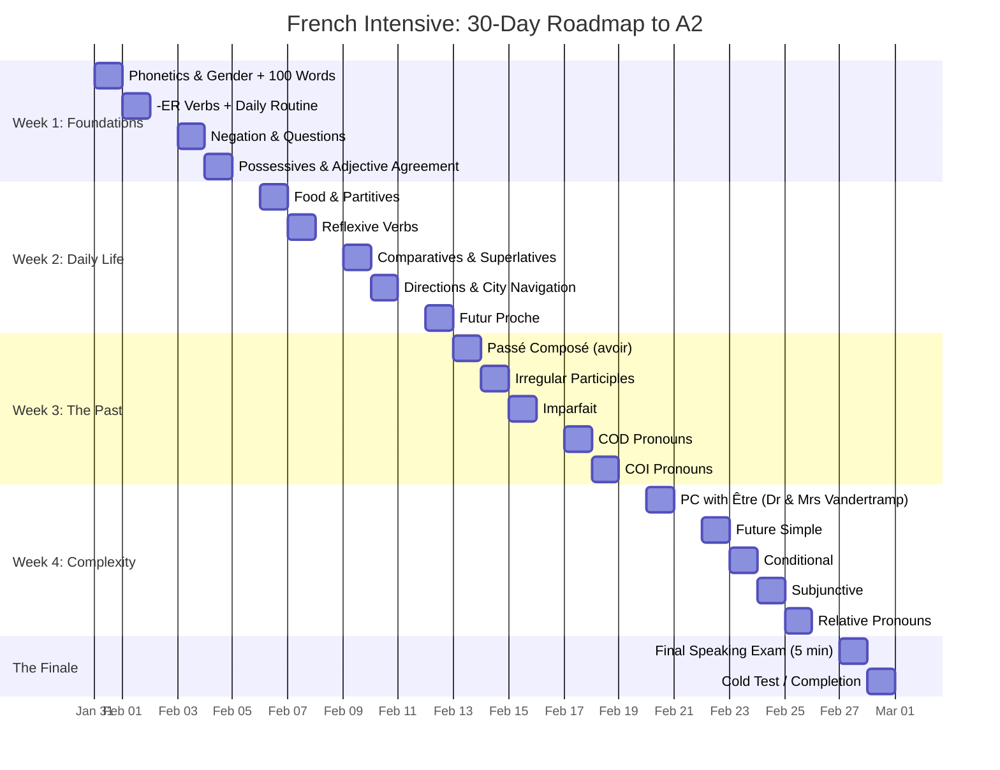

## French Intensive: 30-Day Roadmap to A2

```mermaid
gantt
    title French Intensive: 30-Day Roadmap to A2
    dateFormat YYYY-MM-DD
    axisFormat %b %d

    section Week 1: Foundations
    Phonetics & Gender + 100 Words      :w1a, 2026-01-31, 1d
    -ER Verbs + Daily Routine           :w1b, 2026-02-01, 1d
    Negation & Questions                :w1c, 2026-02-03, 1d
    Possessives & Adjective Agreement   :w1d, 2026-02-04, 1d

    section Week 2: Daily Life
    Food & Partitives                   :w2a, 2026-02-06, 1d
    Reflexive Verbs                     :w2b, 2026-02-07, 1d
    Comparatives & Superlatives         :w2c, 2026-02-09, 1d
    Directions & City Navigation        :w2d, 2026-02-10, 1d
    Futur Proche                        :w2e, 2026-02-12, 1d

    section Week 3: The Past
    Passé Composé (avoir)               :w3a, 2026-02-13, 1d
    Irregular Participles               :w3b, 2026-02-14, 1d
    Imparfait                           :w3c, 2026-02-15, 1d
    COD Pronouns                        :w3d, 2026-02-17, 1d
    COI Pronouns                        :w3e, 2026-02-18, 1d

    section Week 4: Complexity
    PC with Être (Dr & Mrs Vandertramp) :w4a, 2026-02-20, 1d
    Future Simple                       :w4b, 2026-02-22, 1d
    Conditional                         :w4c, 2026-02-23, 1d
    Subjunctive                         :w4d, 2026-02-24, 1d
    Relative Pronouns                   :w4e, 2026-02-25, 1d

    section The Finale
    Final Speaking Exam (5 min)         :final1, 2026-02-27, 1d
    Cold Test / Completion              :final2, 2026-02-28, 1d
```
